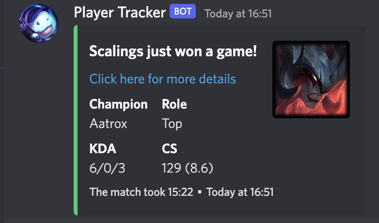
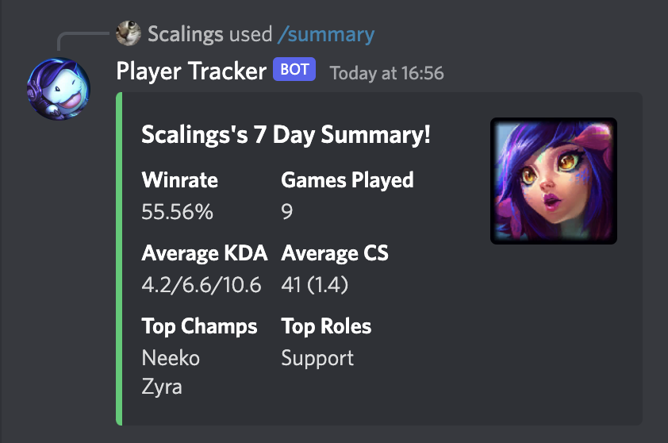
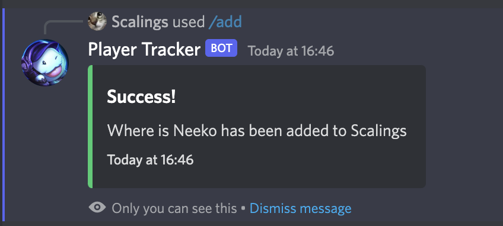
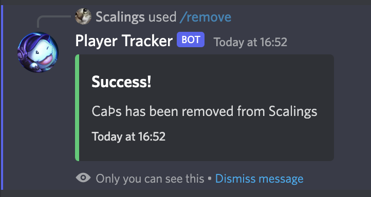
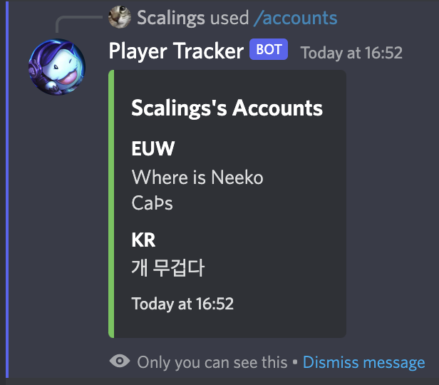

# League Player Tracker

## About
This Discord bot utilises the Riot Games API & MongoDB to track users accounts and summarise information on a per game or over a time span. 

## Features 
- Generate a Week or 24 hour summary of a players accounts.
- Track multiple accounts per user.
- Customizable output.
- Add accounts to a user.
- Remove accounts from a user.
- List all users accounts.

## Examples

## Setup & start guide
Run `npm install` in the root directory.

Create a file named `.env` using the `.env-template`.

Run `npm run build` to build the bot.

Finally `npm run start` to start the bot. 

